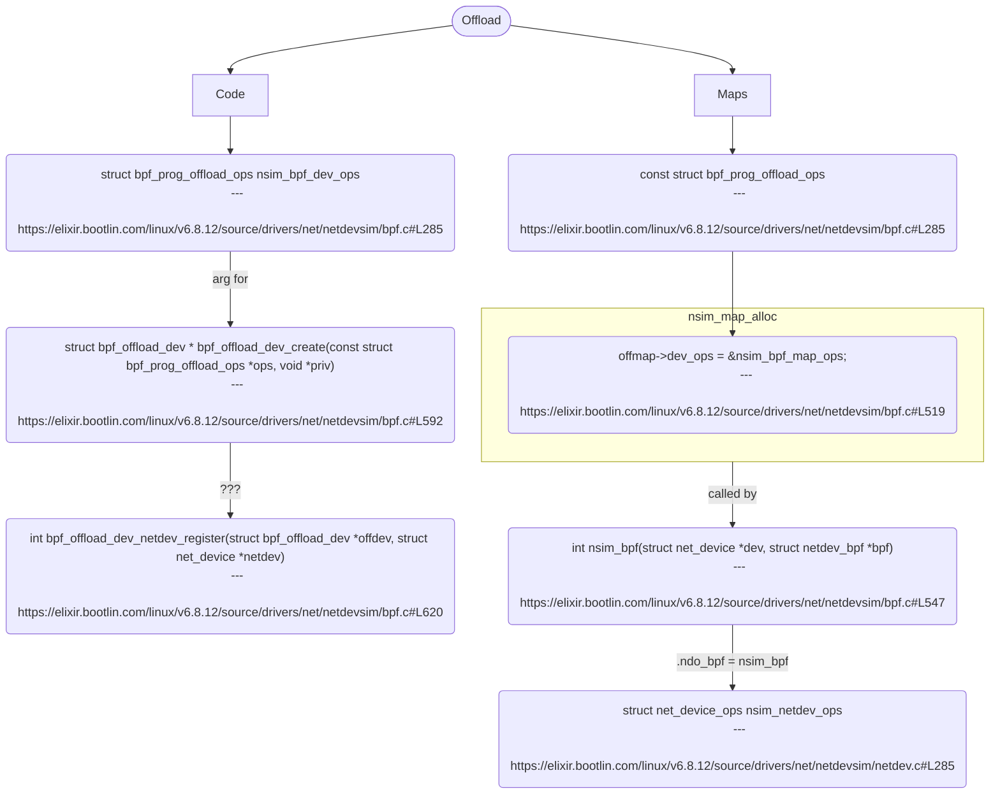

# Offload

```mermaid
flowchart
    start([Offload])
    code[Code]
    maps[Maps]

    nsim_bpf_dev_ops("struct bpf_prog_offload_ops nsim_bpf_dev_ops
    ---
    https://elixir.bootlin.com/linux/v6.8.12/source/drivers/net/netdevsim/bpf.c#L285")
    
    bpf_offload_dev_create("struct bpf_offload_dev * bpf_offload_dev_create(const struct bpf_prog_offload_ops *ops, void *priv)
    ---
    https://elixir.bootlin.com/linux/v6.8.12/source/drivers/net/netdevsim/bpf.c#L592")

    bpf_offload_dev_netdev_register("int bpf_offload_dev_netdev_register(struct bpf_offload_dev *offdev, struct net_device *netdev)
    ---
    https://elixir.bootlin.com/linux/v6.8.12/source/drivers/net/netdevsim/bpf.c#L620")
    
    bpf_maps_dev_ops("const struct bpf_prog_offload_ops
    ---
    https://elixir.bootlin.com/linux/v6.8.12/source/drivers/net/netdevsim/bpf.c#L285")

    subgraph nsim_map_alloc
        offmap("offmap->dev_ops = &nsim_bpf_map_ops;
        ---
        https://elixir.bootlin.com/linux/v6.8.12/source/drivers/net/netdevsim/bpf.c#L519")
    end

    nsim_bpf("int nsim_bpf(struct net_device *dev, struct netdev_bpf *bpf)
    ---
    https://elixir.bootlin.com/linux/v6.8.12/source/drivers/net/netdevsim/bpf.c#L547")

    nsim_netdev_ops("struct net_device_ops nsim_netdev_ops
    ---
    https://elixir.bootlin.com/linux/v6.8.12/source/drivers/net/netdevsim/netdev.c#L285")

    start --> code
    code --> nsim_bpf_dev_ops
    nsim_bpf_dev_ops -- "arg for" --> bpf_offload_dev_create
    bpf_offload_dev_create -- "???" --> bpf_offload_dev_netdev_register
    
    start --> maps
    maps --> bpf_maps_dev_ops
    bpf_maps_dev_ops --> offmap
    nsim_map_alloc -- "called by" --> nsim_bpf
    nsim_bpf -- ".ndo_bpf = nsim_bpf" --> nsim_netdev_ops
```