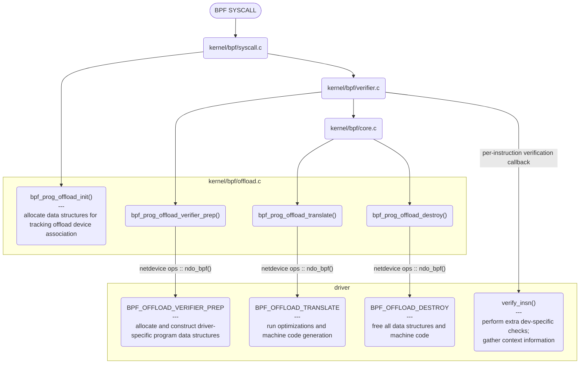

# Program code offload

## Flow


## Interfaces
The driver has to implement two interfaces:

### bpf_prog_offload_ops

```C
static const struct bpf_prog_offload_ops rvo_offload_ops = {
	.insn_hook = rvo_isn_verify,
	.finalize = rvo_finalize,
	.replace_insn = rvo_replace_insn,
	.remove_insns = rvo_remove_insns,
	.prepare = rvo_prepare,
	.translate = rvo_translate,
	.destroy = rvo_destroy,
};
```

This struct handles the operations related to verification and translation.

### ndo_bpf
- Seems like this is a function that has to be registered by a device once it is loaded by the OS
- Do I need to have a netdev in order to be able to offload ?
- All the meta structs initializations are done here

## Verification
The main problems to exclude are from jumps:
- [kfunc](https://docs.kernel.org/bpf/kfuncs.html) jump -> kfunc addresses are pointers to host memory (which is not inside the accellerator)
- [bpf helper](https://man7.org/linux/man-pages/man7/bpf-helpers.7.html) jump -> these need to be implemented inside the accellerator to be used
  - TODO: understand how to eventually remap jumps to code inside the accelerator
- Tail jump: can a bpf function in the accelerator call a bpf function from the host kernel ?


