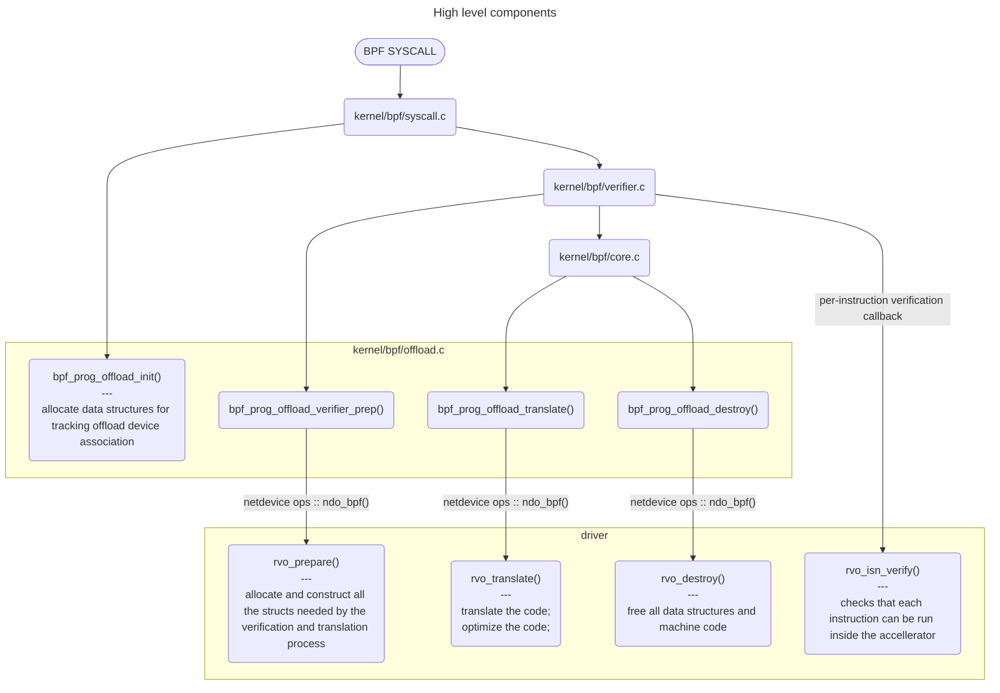
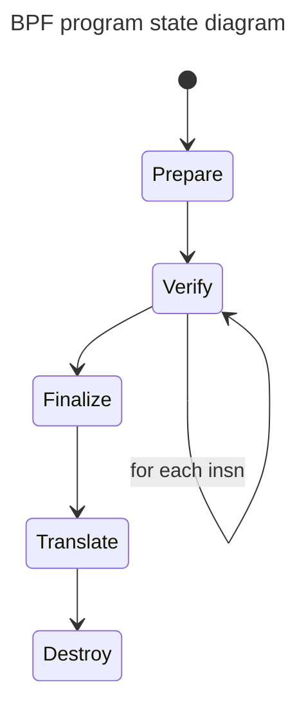
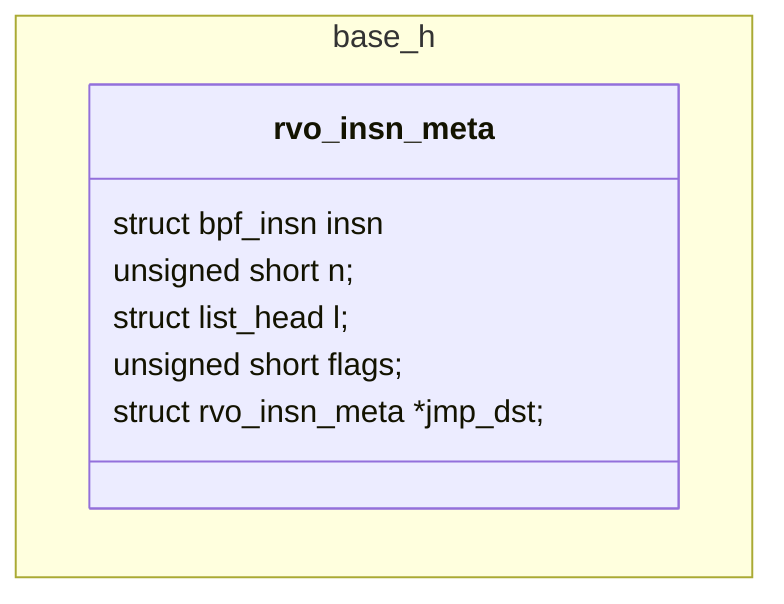

# Program code offload

## Flow

```mermaid
---
title: High level components
---
flowchart
    sys([BPF SYSCALL])
    sys_c(kernel/bpf/syscall.c)
    verifier_c(kernel/bpf/verifier.c)
    core_c(kernel/bpf/core.c)
    
    
    subgraph kernel/bpf/offload.c
        bpf_prog_offload_init("`bpf_prog_offload_init()
        ---
        allocate data structures for tracking offload device association`")

        bpf_prog_offload_verifier_prep("bpf_prog_offload_verifier_prep()")

        bpf_prog_offload_translate("bpf_prog_offload_translate()")
        bpf_prog_offload_destroy("bpf_prog_offload_destroy()")
    end
    
    subgraph driver

        BPF_OFFLOAD_VERIFIER_PREP("`rvo_prepare()
        ---
        allocate and construct all the structs needed by the verification and translation process`")

        BPF_OFFLOAD_TRANSLATE("`rvo_translate()
        ---
        translate the code;
        optimize the code;`")

        BPF_OFFLOAD_DESTROY("`rvo_destroy()
        ---
        free all data structures and machine code`")

        verify_insn("`rvo_isn_verify()
        ---
        checks that each instruction can be run inside the accellerator`")
    end
    
    sys --> sys_c
    sys_c --> verifier_c
    sys_c --> bpf_prog_offload_init
    verifier_c --> bpf_prog_offload_verifier_prep
    bpf_prog_offload_verifier_prep -- "netdevice ops :: ndo_bpf()" --> BPF_OFFLOAD_VERIFIER_PREP
    verifier_c --> core_c
    verifier_c -- per-instruction verification callback --> verify_insn
    core_c --> bpf_prog_offload_translate
    bpf_prog_offload_translate -- "netdevice ops :: ndo_bpf()" --> BPF_OFFLOAD_TRANSLATE
    core_c --> bpf_prog_offload_destroy
    bpf_prog_offload_destroy -- "netdevice ops :: ndo_bpf()" --> BPF_OFFLOAD_DESTROY
    
```

## Interface
The driver has to implement this interface:

### bpf_prog_offload_ops

```C
static const struct bpf_prog_offload_ops rvo_offload_ops = {
	.insn_hook = rvo_isn_verify,
	.finalize = rvo_finalize,
	.replace_insn = rvo_replace_insn,
	.remove_insns = rvo_remove_insns,
	.prepare = rvo_prepare,
	.translate = rvo_translate,
	.destroy = rvo_destroy,
};
```

This struct handles the operations related to verification and translation of the code.

### Sequence


```mermaid
---
title: BPF program state diagram
---
stateDiagram-v2
    state "Prepare" as prep
    state "Verify" as verify
    state "Translate" as tr
    state "Finalize" as fin
    state "Destroy" as des
    
    [*] --> prep
    prep --> verify
    verify --> verify: for each insn
    verify --> fin 
    fin --> tr
    tr --> des
```

## Structs

```mermaid
classDiagram

  namespace base_h {
    class rvo_insn_meta {
      struct bpf_insn insn
      unsigned short n;
      struct list_head l;
      unsigned short flags;
      struct rvo_insn_meta *jmp_dst;
    }
  }

```


## Prepare

- Allocate `struct rvo_prog` and saves it in `prog->aux->offload->dev_priv`
- Init list `rvo_prog.insn_meta`
- first loop:
  - Allocate new `rvo_insn_meta`
    - Save pointer to relative instruction inside the meta struct `rvo_insn_meta->insn = bpf_insns[i]`
    - Save index `rvo_insn_meta->n = i`
  - Add struct to list (tail)
- Set `rvo_prog.bpf_ninsns`
- second loop:
  - if pseudcall -> dst_idx = curr_idx + 1 + imm
  - else dst_idx = curr_idx + 1 + off

## Verify
The main problems to exclude are jumps to functions in the kernel:
- [kfunc](https://docs.kernel.org/bpf/kfuncs.html) jump -> kfunc addresses are pointers to host memory (which is not inside the accellerator)
- [bpf helper](https://man7.org/linux/man-pages/man7/bpf-helpers.7.html) jump -> these need to be implemented inside the accellerator to be used
  - TODO: understand how to eventually remap jumps to code inside the accelerator
- Tail jump: can a bpf function in the accelerator call a bpf function from the host kernel ?

## Translate (JIT)

## Finalize

## 