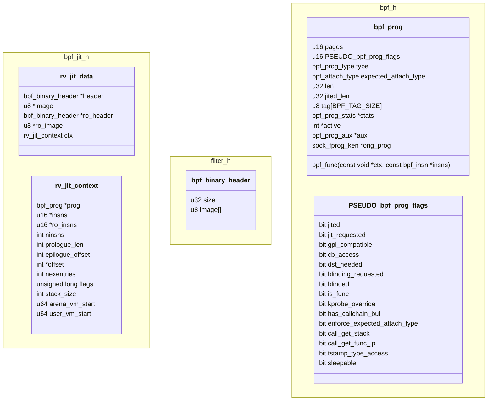

# Structs

```mermaid
classDiagram

    namespace bpf_jit_h {
        class rv_jit_data {
            bpf_binary_header *header
            u8 *image
            bpf_binary_header *ro_header
            u8 *ro_image
            rv_jit_context ctx
        }
        
        class rv_jit_context {
            bpf_prog *prog
            u16 *insns
            u16 *ro_insns
            int ninsns
            int prologue_len
            int epilogue_offset
            int *offset
            int nexentries
            unsigned long flags
            int stack_size
            u64 arena_vm_start
            u64 user_vm_start
        }
    }
            
    
    namespace filter_h {
    
        class bpf_binary_header {
            u32 size
            u8 image[] 
        }

    }

    namespace bpf_h {

        class bpf_prog {
            u16 pages
            u16 PSEUDO_bpf_prog_flags
            bpf_prog_type type
            bpf_attach_type expected_attach_type
            u32 len
            u32 jited_len
            u8 tag[BPF_TAG_SIZE]
            bpf_prog_stats *stats
            int *active
            bpf_func(const void *ctx, const bpf_insn *insns)
            bpf_prog_aux *aux
            sock_fprog_ken *orig_prog
            
        }
        
        class PSEUDO_bpf_prog_flags {
            bit jited
            bit jit_requested
            bit gpl_compatible
            bit cb_access
            bit dst_needed
            bit blinding_requested
            bit blinded
            bit is_func
            bit kprobe_override
            bit has_callchain_buf
            bit enforce_expected_attach_type
            bit call_get_stack
            bit call_get_func_ip
            bit tstamp_type_access
            bit sleepable
        }

    }
    

```